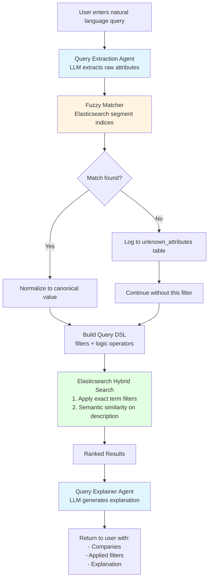

# Fullstack AI Jam Writeup

## Intro
Our goal is to build a tool that helps VCs discover companies using natural language. In particular,
we are targeting this tool towards the following user persona:

**Laurie Bream, General Partner at $500M Series A-B Fund**
- **Time-starved decision maker:** Reviews 200+ pitches weekly with only 1-2 hours for proactive sourcing; needs to identify high-potential companies in minutes
- **Strategic portfolio builder:** Manages 45 active investments and seeks companies that complement existing portfolio for synergies, requiring nuanced understanding beyond basic keyword matching
- **Thesis-driven investor:** Searches for companies matching complex, evolving investment theses (e.g., "API-first vertical SaaS for regulated industries") that traditional search tools miss

Our priority is Accuracy > Speed > Cost

## Design Decisions
First, let's discuss the user experience that we want to have. We want a natural language interface and powerful, explainable
results.

When it came to designing the UI, I imagine a use case where our VC is typing in a generic query.
Let's say it originally has 20 results and we want to drill down. Or perhaps we are capturing too many
results (eg. "Late Stage" is capturing series B+ startups while we only care about Series C+). I want our VC
to be able to quickly interact with the results without needing explicit instructions.

This led me to come up with my design for a "filter focused" UX: We will return a set of 
inferred filters based on our user's query that the user can quickly remove and add.

I've also made the design decision to keep the user's existing filter when the results change. That way, if
the user wants to drill down by adding more details, her existing modifications (eg. location filter) will still apply

In terms of the filters to support, I have decided to go with 
- Industry: eg. Cloud Infrastructure, Cybersecurity, FinTech
- Location (City): eg. New York, San Francisco
- Business Model: eg. SaaS, B2B, Consulting
- Funding Stage: eg. Series A, Public
- Revenue Models: Freemium, Enterprise License
- Target Market: Startups, Manufacturing

I have selected these as they have good coverage to handle high order intent queries relating
to complimentary investments.

## Engineering Design


To handle this "filter focused" approach, I need to be able to map a high level query eg.
"Fintech SaaS in New York or San Francisco" to discrete filters (Industry->Fintech, Business Model->SaaS, Location->New York OR San Francisco)

In addition to filter focused approach, I will also use semantic similarity to match companies based 
on their website and description to the query.

For these kind of hybrid search use cases, I have decided to use ElasticSearch as my primary search database
as from my experience, it excels in these scenarios. I will continue to use Postgres as the main source of truth, 
FastAPI for the backend and React for the frontend as I have good experience with them.

### Consideration: Postgres - Keep or Not to Keep?
I debated whether to still keep around Postgres as we aren't actively using it but I decided to keep it for the following 
reasons.
1. As the source of truth of all data
2. For flexibility for adding additional information that might not be needed in ES (eg. historical employee count)
3. Redundancy, in the event of an ES outage, we can still fallback to using Postgres

### Filter First Approach
I debated whether to use this approach or a more flexible text match or LLM powered approach. I decided to go ahead with
Filter First for the following reasons 
1. Precision matters most: VC would rather see 10 perfect matches than 100 maybes
2. Time is precious: Fast exact filters + small vector search = <500ms response
3. Explainability required: Investment decisions need justification
4. Structured data is gold: I'm anticipating that it should be easier to pull accurate data for some metrics like Location, employee count etc.

### Pipeline


#### Attribute Extraction Agent
This agent takes in a company's information and returns a prediction of which supported attribute values it has
eg. "Superblocks is the only internal app generation platform powering mission critical operations at global enterprises like Instacart, Credit Karma, and Carrier" -> Industry: Enterprise Software, AI & Machine Learning, Target Markets: Enterprise 

#### Query Extraction Agent
This agent takes in a user's query and returns a prediction of which supported attribute values it has

I was initially passing the agents a list of all supported values to use; however, I chose to transition
away from this approach as the set of possible values can grow very large and will lead to increased processing costs and time.

Instead, I will have a fuzzy matcher that matches synonyms or similar representations to the normalized value.
eg ["HealthTech", "Healthcare Technology", "Health IT", "Digital Health"] should all map to "Healthcare IT".

To achieve this, I created indices in Elastic Search for all supported attributes and used that to power
the matching. I tried a few test cases and arrived on an approach through trial and error

#### Attributes Query DSL
To handle complex queries such as "include companies where the location is in (NY AND SF) AND industry is ("FINTECH") and employee_count is "> 100"
I created a DSL that all agents will use that can easily be mapped into an ES query
```
{{
    "logic": "AND",        ← TOP-LEVEL logic: combines all filters below
    "filters": [
        {{
            "segment": "industries",
            "type": "text",
            "logic": "OR",     ← SEGMENT-LEVEL logic: how to combine the rules below (OR/AND)
            "rules": [
                {{"op": "EQ", "value": "AI/ML"}},      ← RULE-LEVEL op: comparison operator (EQ/NEQ/GT/GTE/LT/LTE)
                {{"op": "EQ", "value": "FinTech"}}
            ]
        }},
        {{
            "segment": "employee_count",
            "type": "numeric",
            "logic": "AND",    ← SEGMENT-LEVEL logic: AND for ranges
            "rules": [
                {{"op": "GTE", "value": 50}},          ← RULE-LEVEL op: GTE (greater than or equal)
                {{"op": "LTE", "value": 100}}          ← RULE-LEVEL op: LTE (less than or equal)
            ]
        }}
    ]
}}
``` 


#### Query Explainer
One benefit of using the filter first approach with semantic filter is that results are very straightforward to explain.
However, given the level of detail that we would like our VC to have and the fact that we would like to prioritize
quality over speed and cost; I have decided to use an Agent for the explanations as well even though it is significantly
slower and costlier

#### UI/UX Considerations
I have done the following to have a better use case for our VC 
- If the user is updating an existing query, we will keep the exisiting filters applied. Otherwise the filters are removed This is done by detecting if the existing query has been removed entirely (by checking if it has been 
copy pasted over or cleared entirely).
- If the user removes a filter, we continue to filter it out even if our agent predicts that it should be applied
- The VC is able to save searches they built and restore them for future use.


## Bonus Features
One question I had is what if there is an attribute out there that our system isn't aware of.
To handle this case, I have added a feature where all such attributes are logged to a table.
An admin user is then able to add it as a value or as a synonym. Check it out in the /admin view!!

## Models Used
For vector generation, I have used BGE-M3 since it is a local model and can give good results.


## Additional things I would have liked to do
1. I chose my models and cutoffs based on brief trial and error and some test cases. Given more time,
I would like to be able to try different approaches and evaluate based on their precision and recall
2. Complex query builder on the frontend. The ability for our VC to build more complex queries involving nested ands and ors would be useful for doing deep dives into results
3. Better cache support. 